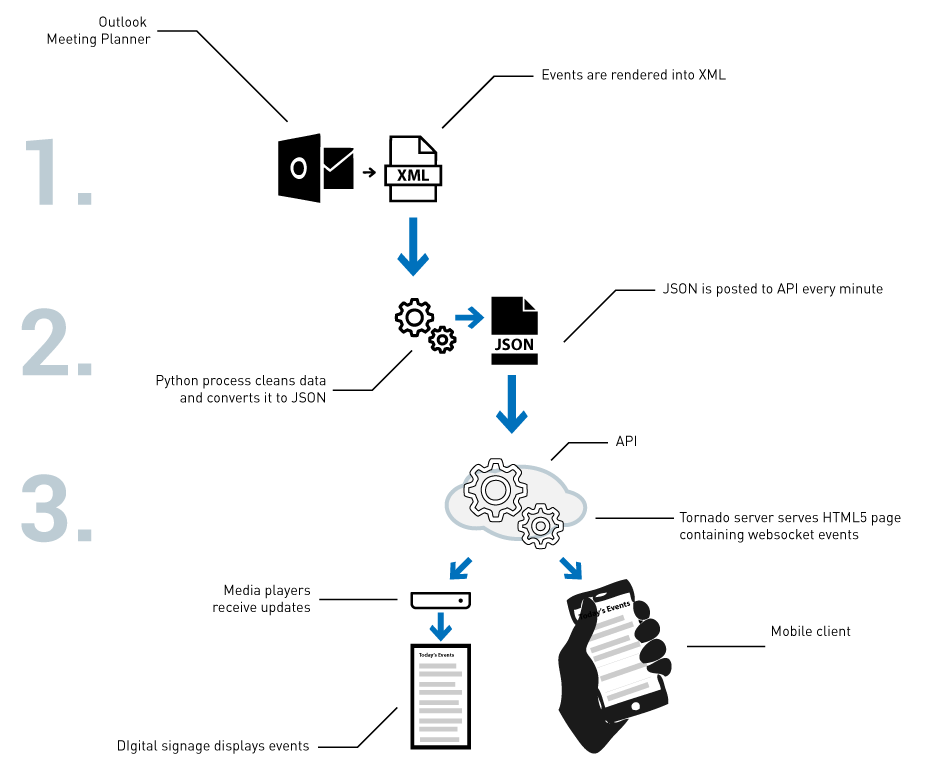
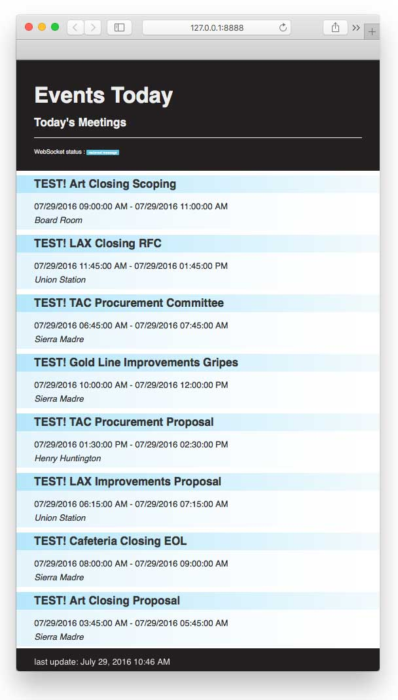

# Metro Signage Server
#### July 2016 | Douglas Goodwin

There are three parts to this application:

1. XML export from Outlook
2. Python XML parser and JSON emitter
3. JSON API and Websocket server



#### Part 1 publishes current meetings scheduled in Outlook as an XML feed.
#### Part 2 GETs the XML, parses and converts it to JSON then POSTs the JSON to Part 3.
#### Part 3 parses the JSON and pushes content to the clients over websockets.

---

# Try it out!

```
git clone https://github.com/LACMTA/eventsignage.git
cd eventsignage
virtualenv .
pip install -r requirements.txt

# set up your secret variables by editing mysettings.py
cp mysettings.py.SAMPLE mysettings.py

```

## Run Part 3: the Tornado API and websocket server

```
# start the server on 127.0.0.1:8888
python app.py
```

## Open a new terminal window and send some test events from Part 2.


```
cd part_2 ;
python fetch_parse_emit.py
```

## [Et voilà!](http://127.0.0.1:8888)

You should now see random Metro-flavored events cycle in the browser. Woo!



